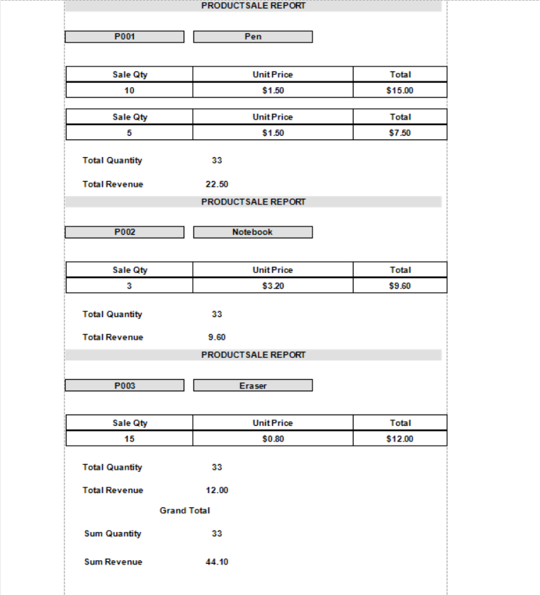

# 🧾 Product Sales Reporting Tool

A C# WinForms application that connects to a SQL Server database, filters product sales data by date, and displays the results using a DevExpress XtraReport with grouping, totals, and dynamic date filtering.

---

## 📦 Features

- Filter product sales by date range
- Group by product name
- Calculate and display totals
- Print/export-ready report using DevExpress
- Connects to SQL Server using Windows Authentication

---

## 🚀 Setup Instructions

1. Open the solution file `ProductSaleReport.sln` in Visual Studio.
2. Make sure DevExpress components are installed (trial or licensed).
3. Run the SQL script `CreateAndSeed_ProductSales.sql` in SQL Server to create and seed the `PRODUCTSALES` table.
4. Build and run the project.
5. Select a date range and click **Generate** to display the report.

---

## 🔌 Database Connection

The application uses **Windows Authentication** to connect to SQL Server.

### Sample Connection String in `App.config`:

```xml
<connectionStrings>
  <add name="ProductDb"
       connectionString="Server=.\SQLEXPRESS;Database=productdb;Trusted_Connection=True;"
       providerName="System.Data.SqlClient" />
</connectionStrings>
```

## 📷 Report Output



## 👨‍💻 Author
  Horng Navy
  Created as part of a coding test / assignment.
